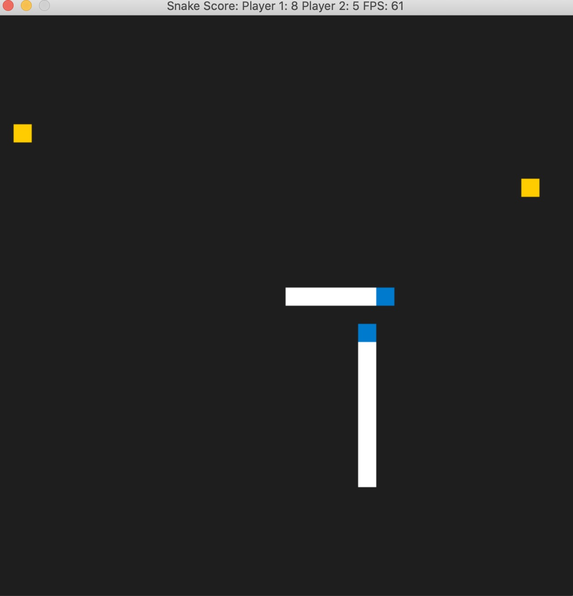

# CPPND: Capstone Catch the Snake Game

This is the repo for my Capstone project in the [Udacity C++ Nanodegree Program](https://www.udacity.com/course/c-plus-plus-nanodegree--nd213). The code for this repo was inspired by [this](https://codereview.stackexchange.com/questions/212296/snake-game-in-c-with-sdl) excellent StackOverflow post and set of responses.

My Extensions to the original repo:
* You can play the game in Single Player Mode or Two Players Mode by changing the value of `kTwoPlayerMode` in `main.cpp`;
* You can toggle pausing the game by pressing `SPACEBAR`.
* You can restart a game by pressing key `N`.
* In Two Players Mode, you can catch another snake by trapping it. As long as the other snake touches you with its head, you devour it and grow in size. The other snake would then regenerate and continue to play it.
* Games records are written into a file.
* When run with a little bit of luck (1 out of 5 times), two snakes will constantly have ten number of 'foods', i.e, an eating spree.

Happy catching!

## Dependencies for Running Locally
* cmake >= 3.7
  * All OSes: [click here for installation instructions](https://cmake.org/install/)
* make >= 4.1 (Linux, Mac), 3.81 (Windows)
  * Linux: make is installed by default on most Linux distros
  * Mac: [install Xcode command line tools to get make](https://developer.apple.com/xcode/features/)
  * Windows: [Click here for installation instructions](http://gnuwin32.sourceforge.net/packages/make.htm)
* SDL2 >= 2.0
  * All installation instructions can be found [here](https://wiki.libsdl.org/Installation)
  * Note that for Linux, an `apt` or `apt-get` installation is preferred to building from source.
* gcc/g++ >= 5.4
  * Linux: gcc / g++ is installed by default on most Linux distros
  * Mac: same deal as make - [install Xcode command line tools](https://developer.apple.com/xcode/features/)
  * Windows: recommend using [MinGW](http://www.mingw.org/)

## Basic Build Instructions

1. Clone this repo.
2. Make a build directory in the top level directory: `mkdir build && cd build`
3. Compile: `cmake .. && make`
4. Run it: `./SnakeGame`.